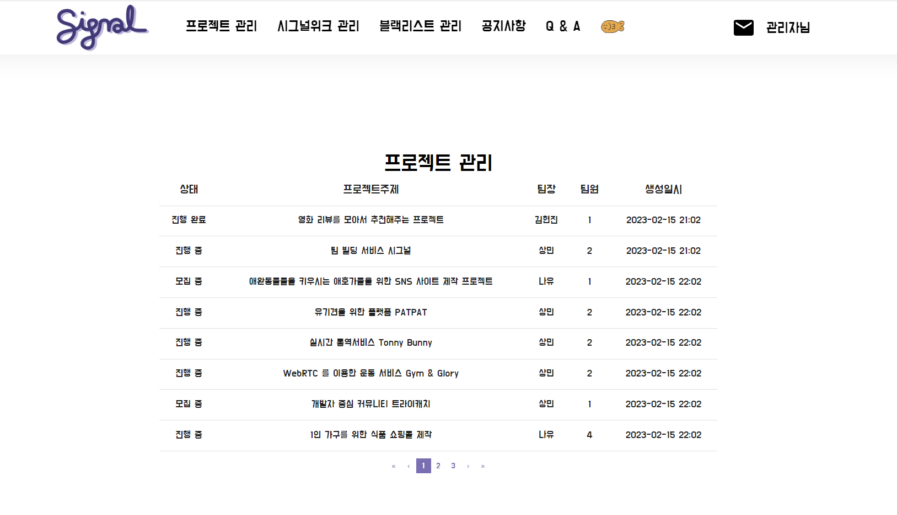

# 🖥️ Signal : WebRTC를 활용한 IT프로젝트 팀 빌딩 서비스

## 🏆 삼성 청년 SW 아카데미 - 공통 프로젝트 우수상 수상 프로젝트

## 🏅 미래산업 인재육성 컨퍼런스 - 프로젝트 공모전 본선 경연 진출 프로젝트

# 서비스 소개

---

## 1. 🗓️프로젝트 기간

- 2023.01.09 (월) ~ 2023. 02. 17 (목)

---

## 2. 👥팀 구성

### 붕어빵 🐟🍞

- 팀장
  - 황수빈
- 팀원
  - 권혁근
  - 김현진
  - 나유진
  - 박상민
  - 정인모

---

## 3. 💫 기획의도와 목적

> AI와 메타버스 등, 나날이 발전하는 4차 산업 기술로 인해 프로그래밍과 IT업계에 대한 관심이 증가하고 있다.
> 이에 따라 주니어 개발자와 SW역량을 쌓고자 하는 타 분야 종사자들 또한 늘어나는 추세다.
> 개발자에게는 탄탄한 이론도 필요하지만, 프로젝트 경험도 그에 못지 않게 중요하다는 것은 너무나 자명한 사실이다.
> 다만 **혼자 할 수 있는 이론 공부와 달리 여러 사람이 진행하는 프로젝트는 시작 전부터 많은 문제점에 봉착**한다.
> 우리는 이러한 문제들을 해결하여 **보다 간편하고 프로젝트 진행을 도와줄 IT프로젝트 팀 빌딩 서비스**를 제작하고자 한다.

### 1. 마주한 문제점

#### 역량과 관심사의 차이

- 주니어 개발자들이 마주하는 여러 문제 중, 스스로 해결하기 매우 곤란한 것 중 하나가 프로젝트 팀을 꾸리는 것이다.
  역량과 관심사의 차이로 주변에 개발자가 있다 해도 팀을 꾸리지 못하는 경우도 있고, 아예 개발자 인맥이 없는 경우도 많다.

#### ‘프리라이더’

- 그리고 어떻게든 팀을 꾸린다고 해도, 열정적으로 참여하지 않는, 일명 ‘프리라이더’ 문제로 팀원 간 불화를 겪거나 아예 팀이 해체되는 경우도 있다.

#### 제 3자의 피드백

- 또한 프로젝트가 실제 서비스까지 이루어지지 않는다면 제 3자에게서 피드백을 받기 어렵다는 문제점도 있다.

### 2. 프로젝트의 목적

- 이렇듯 팀을 꾸리기 어려운 주니어 개발자나,
  보다 다양한 사람과 프로젝트를 진행하고자 하는 IT 업계 종사자, 개발자들이
  **사전 영상 미팅과 프로필 열람을 통해 수준과 관심, 여건에 맞는 팀원과 팀을 꾸려
  팀의 해체 없이 프로젝트를 완성해내도록 도와주는 서비스**를 제작하고자 한다.
- 추가적으로, 프로젝트를 Signal 내에서 공유하여 이용자 간의 피드백이 가능하도록 만들 것이다.

### 3. 서비스의 대상

- 본 서비스의 주요 서비스 대상은 다음과 같다.

  1. 개발자 인맥이 적은, 개발을 시작한 지 얼마 안 된 주니어 개발자

  2. 사이드 프로젝트를 진행하고 싶은 시니어 개발자

  3. 보다 다양한 분야, 포지션의 사람들과 프로젝트를 진행하고자 하는 IT업계 종사자

---

## 4. 🖥️ Signal 주요 서비스 개요

### 1 ) 보다 쉬운 프로젝트 팀 빌딩 및 매칭 서비스

#### 주제, 포지션, 기술 스택 등 다양한 조건의 프로젝트 모집 공고

- 프로젝트의 주제와 기술 스택, 포지션, 진행 기간 및 난이도 등 다양한 조건을 설정하여 프로젝트 모집 공고를 등록할 수 있다.

#### 자신과 맞는 공고에 지원!

- 이용자는 모집 공고를 확인하고 진행하고 싶은 프로젝트에 지원할 수 있다.

#### 오픈 프로필을 통한 영입 제안!

- 또한 오픈 프로필 상에 기술 스택 및 관심사를 설정하여 팀원을 구하는 다른 팀에게 영입 제안을 받을 수 있다.

### 2 ) 프리라이더 및 팀 해체 방지를 위한 시스템

#### 사전 미팅을 통한 신중한 팀원 선택

- 팀장은 프로젝트에 지원한 예비 팀원과 사전 미팅을 나누어, 더욱 심도 깊은 판단을 내릴 수 있다.

#### 책임을 위한 보증금 제도

- 프로젝트 시작 시, 서비스 내에서 사용되는 재화인 ‘하트’를 보증금 개념으로 사용하며, 중도 팀 탈퇴 시 하트를 돌려받지 못한다.

#### 팀원 상호 평가를 통한 경고 시스템

- 회의와 함께 진행되는 팀원 상호 평가에서 지속적으로 낮은 평가를 받을 경우, 경고와 함께 팀에서 방출될 수 있다.
- 팀 방출, 탈퇴가 이루어진 이용자는 해당 프로젝트에 다시 지원할 수 없도록 하여 다른 팀원의 피해를 최소화한다.

### 3 ) 프로젝트 진행을 위한 화상 채팅과 부가 기능 제공

#### 실시간 화상채팅 제공

- 프로젝트 팀을 결성한 후, 팀 모두가 사용할 수 있는 화상 회의실을 웹에서 제공한다.

#### 동시 편집 텍스트 에디터, 공유 그림 툴 제공

- 화상 회의실과 함께 실시간 동시 편집이 가능한 텍스트 에디터도 제공한다.
- 공유 화면 위에 그릴 수 있는 그리기 툴도 제공한다.

#### To Do List 제공

- 팀 프로젝트 대시보드에서 To Do list를 기록하여 모두가 공유하며, 팀원 상호 평가에 참고할 수 있다.

### 4 ) 프로젝트 평가를 위한 장 “Signal Weeks” 진행과 명예의 전당

#### 다른 팀의 프로젝트 조회와 평가

- 분기별로 서비스 내에서 진행한 프로젝트를 시그널 윅스에 공유할 수 있다.
- 평가 기간 동안 이용자들은 다른 팀의 프로젝트에 평가를 남기고 팀장에게 쪽지를 보내며 피드백을 줄 수 있다.
- 명예의 전당에서는 이전 분기의 우수 프로젝트를 확인할 수 있다.

#### 우수 프로젝트에게는 베네핏 제공

- 분기별 랭킹 상위 3팀은 하트를 베네핏으로 지급 받으며, 명예의 전당에 등록된다.

---

## 5. 아키텍처

---

## 6. 👀 서비스 화면

### 1. 메인페이지

**회원가입**

**로그인**

### 2. 팀 매칭

**팀원 모집** - 공고와 오픈 프로필을 선택할 수 있습니다.

**공고** - 공고 모집창을 볼수있어서 원하는 프로젝트에 지원할 수있습니다.

- 원하는 공고를 지원할 수있습니다 .
- 공고화면에서는 마감기한, 프로젝트기간,진행유형, 분야, 진행 지역, 난이도, 포지션 인원, 사용기술, 프로젝트 소개를 볼수있습니다.

**오픈프로필** - 오픈프로필을 등록한 회원의 회원정보와 , 기술 , 경험 , 포지션 , 경력을 볼수있고 그걸 바탕으로 쪽지를 보내 같이 프로젝트를 하자고 할 수 있습니다.

### 3. 프로젝트 진행

**마이 프로젝트 -** 진행중인 프로젝트 와 진행했던 프로젝트를 볼수있습니다.

**프로젝트 관리**

- Todo List, 프로젝트 문서, 화상회의, 동료 평가가 가능합니다
- Todo List에서 해야할일과 한일 체크가능
- 프로젝트 문서에 프로젝트에 쓰일 노션뷰,깃 컨벤션, 요구사항 명세서등 작성가능
- 화상회의에서 화상회의, 화이트보드, 화면공유, 코드편집, 채팅 가능
- 팀원 평가를 통해 팀내 활동을 안하는(프리 라이더) 경고 3번 누적으로 퇴출 가능

### 4. 시그널 위크

**시그널 위크** - 종료된 프로젝트를 등록하여 투표를 받아 명예의 전당에 올릴 수 있음

**명예의 전당** - 각 분기마다 1,2,3등 투표수인 프로젝트에 시상

### 5. 공지사항, Q&A

**공지사항** - 공지사항을 등록 할 수 있음

**Q&A** - Q&A 등록가능

### 6. 마이페이지

**회원 정보** - 하트 충전, 회원정보 수정 가능

**프로필** - 포지션, 기술, 경험, 경력 확인가능

**공고,지원** - 작성한 공고와 지원한공고

### 7. 관리자

**관리자 페이지** - 프로젝트 관리, 시그널위크 관리, 블랙리스트 관리 가능

