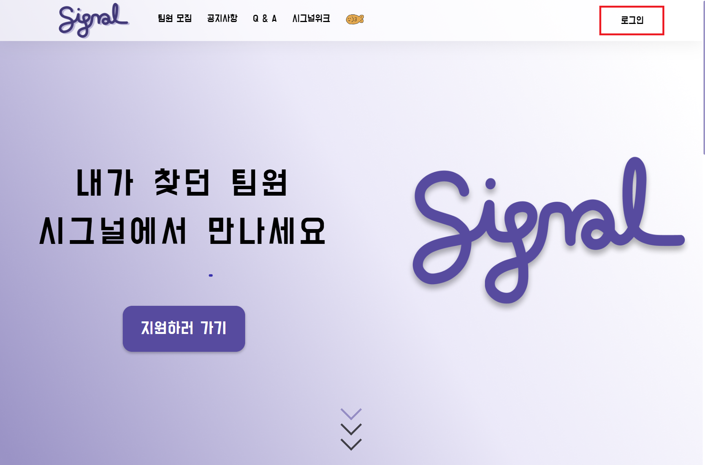

# 산출물

tags: 기획
상태: Not started

## 1. 메인페이지

**회원가입**

**로그인**

---

## 2. 팀 매칭

**팀원 모집** - 공고와 오픈 프로필을 선택할수 있습니다.

**공고** - 공고 모집창을 볼수있어서 원하는 프로젝트에 지원할수있습니다.

- 원하는 공고를 지원할수있습니다 .
- 공고화면에서는 마감기한, 프로젝트기간,진행유형, 분야, 진행 지역, 난이도, 포지션 인원, 사용기술, 프로젝트 소개를 볼수있습니다.

**오픈프로필** - 오픈프로필을 등록한 회원의 회원정보와 , 기술 , 경험 , 포지션 , 경력을 볼수있고 그걸 바탕으로 쪽지를 보내 같이 프로젝트를 하자고 할수 있습니다.

---

### 3. 프로젝트 진행

**마이 프로젝트 -** 진행중인 프로젝트 와 진행했던 프로젝트를 볼수있습니다.

**프로젝트 관리**

- Todo List, 프로젝트 문서, 화상회의, 동료 평가가 가능합니다
- Todo List에서 해야할일과 한일 체크가능
- 프로젝트 문서에 프로젝트에 쓰일 노션뷰,깃 컨벤션, 요구사항 명세서등 작성가능
- 화상회의에서 화상회의, 화이트보드, 화면공유, 코드편집, 채팅 가능
- 팀원 평가를 통해 팀내 활동을 안하는(프리 라이더) 경고 3번 누적으로 퇴출 가능

---

## 4. 시그널 위크

**시그널 위크** - 종료된 프로젝트를 등록하여 투표를 받아 명예의 전당에 올릴 수 있음

**명예의 전당** - 각 분기마다 1,2,3등 투표수인 프로젝트에 시상

---

## 5. 공지사항, Q&A

**공지사항** - 공지사항을 등록 할 수 있음

**Q&A** - Q&A 등록가능

---

## 6. 마이페이지

**회원 정보** - 하트 충전, 회원정보 수정 가능

**프로필** - 포지션, 기술, 경험, 경력 확인가능

**공고,지원** - 작성한 공고와 지원한공고

---

## 7. 관리자

**관리자 페이지** - 프로젝트 관리, 시그널위크 관리, 블랙리스트 관리 가능

# 1. 회원가입

- 오른쪽 로그인 버튼을 클릭

- 회원 가입 버튼을 클릭합니다

- 모든 정보를 작성한뒤 회원가입 버튼을 클릭

- 자신의 이메일로 들어가 이메일 인증을 누른뒤 로그인합니다.

# 2.팀 매칭

- 팀원모집- 공고 혹은 지원하러가기 버튼을 클릭 합니다

- 공고 화면에서 공고 등록 버튼을 누릅니다

- 공고 등록 화면 입니다.

- 사용 기술을 선택합니다

- 화상미팅 예약 선택입니다.

- 하단의 공고 등록 버튼을 눌러 공고를 등록합니다.

- 추가된 공고를 확인할수 있습니다.

- 지원자의 아이디로 접속하여 공고를 클릭한후 지원하기를 누릅니다.

- 지원서의 내용을 채워 넣습니다.

- 화상미팅 예약 시간선택을 합니다

- 지원하기 버튼을 눌러 지원 합니다

- 오픈 프로필 확인 가능

- 프로필 상세 조회를 눌러 상세 조회를 확인 할 수 있습니다.

- 지원 하기를 누르면 마이페이지로 오게되고

- 지원한 공고에서 본인이 지원한 공고를 확인 할 수 있습니다.

- 작성한 공고에서는 작성한 공고를 확인 할 수 있습니다.
- 팀원 선택을 누릅니다

- 사전미팅 버튼을 누르면 사전 화상미팅을 할 수 있습니다.

- 화상미팅 화면 입니다.

- 메모,사전질문 버튼을 클릭하면 해당 목록을 확인할수 있습니다.

- 팀원 선택을 눌러 팀원을 선택합니다.

- 지원취소,거절,확정 상태를 확인할수있습니다.

- 팀원 선택 알림을 받을수도 있습니다.

- 지원서 보기 버튼을 클릭하여 지원서를 확인 할 수도 있습니다

- 프로젝트 시작버튼을 눌러서 프로젝

# 3. 프로젝트 진행

- 마이 프로젝트 버튼을 눌러 진행중인 프로젝트를 확인 합니다.

- 입장하기를 눌러 프로젝트를 확인합니다

- 프로젝트문서에는  
  Notion, Convention , Branch Rule, 요구 사항 명세서, 기능명세서, 와이어 프레임을 확인할수있다

- Noiton 뷰어 기능

- Todo List에서는 오늘할일을 등록하고 완료한 리스트를 확인 할 수 있습니다.

- 화상회의 열기를 누르면 화상회의를 할 수 있습니다.

- 화면 공유에 화이트보드를 이용해 설명하기 쉽게 그림을 그려 줄 수도있습니다

- 채팅 버튼을 클릭하여서 채팅도 할 수 있습니다.

- 코드 편집 기능은 여러명이 하나의 문서에 코딩할수 있습니다.

- 다크모드

- 동로 평가는 팀원의 평가를 할 수 있어서 참여가 저조한 팀원을 퇴출 시킬수 있습니다.

- 체크박스를 클릭한뒤 평가완료를 눌러 평가를 완료 합니다.

- 우측 상단의 톱니 바퀴를 눌러 팀관리,프로젝트 관리를 확인합니다.

- 프로젝트 정보

- 평가가 저조한 팀원은 경고가 쌓이게 되고

- 3회가 쌓이게되면 퇴출버튼이 활성화되어서 퇴출 할 수 있습니다

- 퇴출 당한 팀원이 사라진 모습

- 경고를 받은 팀원은 하트가 삭감되고

- 퇴출이 되면 메일 창에 알림이 옵니다

- 프로젝트 종료 버튼을 눌러 종료 시킬수 있습니다

# 4. 시그널 위크

- 시그널 위크 등록 버튼을 눌러 등록 할 수 있습니다.

- 시그널 위크 등록 화면 입니다. 주제,내용 유튜브주소,배포주소, PDF, README 파일을 넣을수 있습니다

- 시그널 위크 화면입니다.

- 프로젝트 투표버튼, 유튜브영상, 배포 주소를 확인 할 수 있습니다.

- 배포 주소와 기획서를 확인 할 수 있습니다.

- 내용과 README 문서를 확인 할 수 있습니다.

- 명예의 전당 버튼을 클릭하여 명예의 전당에 들어갈수있습니다.

- 해당 분기의 명예의 전당 수상작들을 확인 할 수 있습니다.

- 명예의 전당 역대 수상작 보러가기 버튼을 클릭 합니다

- 역대 시그널위크 수상작을 확인 가능합니다.

# 5. 공지사항 , Q&A 페이지

- 공지사항 입니다.

- 시그널 위크 등록 방법 설명 확인 가능

- Q&A 입니다

- 궁금한점을 물어 볼 수 있습니다.

# 6. 마이 페이지

- 하트충전, 회원정보 수정, 포지션, 스킬, 경험, 경력 확인 가능 합니다.

- 하트 충전 페이지 입니다

- 카카오 페이를 통해 결제 할 수 있습니다.

- 회원정보 수정 가능

- 비밀번호 변경

- 지원한 공고와 작성한 공고 확인 가능

# 7. 관리자 페이지

- 관리자로 로그인 하면 헤더의 창이 다르다.

- 프로젝트 관리 페이지

- 시그널위크 관리 페이지 에서 등록 수정을 관리 할 수 있습니다.

- 등록/수정 가능

- 블랙 리스트 관리 페이지입니다.

# 8. 개발자 페이지

