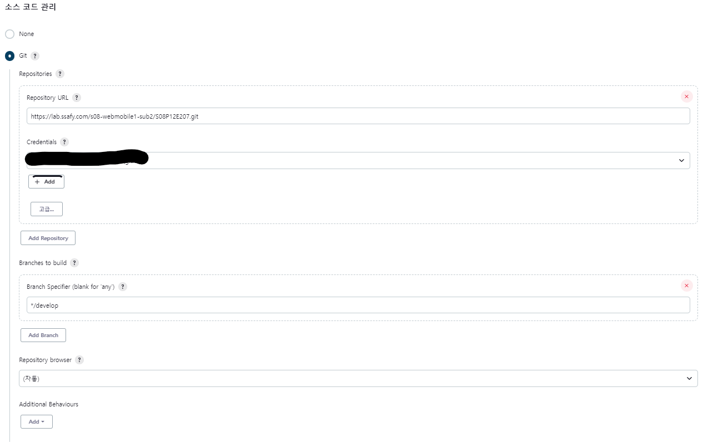

# ❗ 주요 버전

### 1. Front End

- Web Server : Nginx
- NodeJS : 18.13.0
- react : 18.2.0
- react-router-dom : 6.7.0
- socket.io-client : 4.5.4
- axios : 1.2.3
- redux-toolkit : 1.9.1
- mui-material : 5.11.6
- styled-components : 5.3.6

### 2. Back End

- JVM : openjdk 1.8.0_352
- SpringBoot : 2.7.5
- IntelliJ : 2021.3.1

### 3. Media Server

- NodeJS : 10.19.0

### 4. 상세 버전 정보

- frontend : package.json
- backend : build.gradle
- media-server : package.sjon

# ❗ 배포 시 특이 사항

- Develop Server

  - Docker

    ```bash
    # 필수 패키지 설치
    sudo apt-get install apt-transport-https ca-certificates curl gnupg-agent software-properties-common

    # GPG Key 인증
    curl -fsSL https://download.docker.com/linux/ubuntu/gpg | sudo apt-key add -

    # docker repo 등록
    sudo add-apt-repository \
    "deb [arch=amd64] https://download.docker.com/linux/ubuntu \
    $(lsb_release -cs) \
    stable"

    # docker 설치
    sudo apt-get update && sudo apt-get install docker-ce docker-ce-cli containerd.io

    ```

  - Mysql (컨테이너)

    ```bash
    # mysql volume 디렉토리 생성
    sudo mkdir -p /exthdd/docker/mysql

    # mysql 컨테이너 시작
    sudo docker run --name mysql -e MYSQL_ROOT_PASSWORD=[root 계정 비밀번호] -d -p 3306:3306 -v /exthdd/docker/mysql:/var/lib/mysql mysql:latest

    # mysql 컨테이너 shell 접속
    sudo docker exec -it mysql /bin/bash

    # mysql 접속
    mysql -r -p
    Enter password: [root 계정 비밀번호]

    # mysql 외부 접속 계정 생성 및 권한 부여
    mysql> CREATE USER '[계정이름]'@'%' IDENTIFIED BY '[비밀번호]';
    mysql> GRANT ALL PRIVILEGES ON *.* TO '[계정이름]'@'%' WITH GRANT OPTION;
    mysql> FLUSH PRIVILEGES;
    ```

  - Redis

    ```bash
    # Redis 컨테이너 시작
    sudo docker run -d -p 6379:6379 --restart always --name redis redis:lates

    # Redis 내부 접속
    sudo docker exec -it redis /bin/bash

    # Redis-Cli 접속
    redis-cli

    # Redis 보안 설정
    CONFIG SET requirepass "[비밀번호]"
    ```

  - 젠킨스 (컨테이너)

    ```bash
    # 젠킨스 volume 디렉토리 생성
    sudo mkdir -p /exthdd/docker/jenkins

    # 젠킨스 컨테이너 시작
    sudo docker run --name jenkins --restart=unless-stopped -d -p 9090:8080 -p 50000:50000 -v /var/run/docker.sock:/var/run/docker.sock -v /exthdd/docker/jenkins:/var/jenkins_home -u root jenkins/jenkins:lts

    ```

    - Jenkins 플러그인 설치

      - Publish Over SSH
      - NodeJS

    - 젠킨스 프로젝트 생성

      1. 새로운 Item
      2. 프로젝트 이름 입력하고 Freestyle project
      3. 소스코드 관리 설정

         

      4. 빌드유발 설정

         

         - 고급 버큰 클릭 후 secret 키 생성 후 gitlab webhook 에 입력
           

      5. 빌드 환경 설정

         

      6. frontend 빌드 설정

         

      7. backend 빌드 설정

         

      8. SSH 연결 → 빌드파일 이동

         

         - frontend 빌드 파일 이동
           
         - backend 빌드 파일 이동
           
         - 배포 스크립트 실행
           
         - 배포 스크립트

           ```bash
           #/bin/bash
           # FE 재시작
           service nginx restart

           # BE 재시작

           # 현재 구동중인 API 정지
           PID=`ps -ef | grep java | awk '{print $2}'`

           if [ -n "$PID" ]
           then
               kill -9 $PID
           else
               exit
           fi

           # 새로 빌드한 API 백그라운드 실행
           java -jar /home/deploy/backend/*.jar > /dev/null 2>&1 &
           ```

- Deploy Server

  - JDK
    ```bash
    sudo apt update
    sudo apt install openjdk-8-jdk
    ```
  - Nignx

    ```bash
    # Nginx 패키지 설치
    sudo apt update
    sudo apt upgrade
    sudo apt install nginx

    # 기존 설정파일 삭제
    sudo rm -rf /etc/nginx/sites-available/default
    sudo rm -rf /etc/nginx/sites-enabled/default
    sudo nano /etc/nginx/sites-available/deploy.conf
    sudo ln -s /etc/nginx/sites-available/deploy.conf /etc/nginx/sites-enabled
    ```

    ```bash
    # /etc/nginx/sites-available/deploy.conf
    server {
        server_name [도메인주소];
        location / {
          root   [frontend 디렉토리 경로];
          index  index.html index.htm;
          try_files $uri $uri/ /index.html;
        }
        location /api {
            add_header 'Access-Control-Allow-Origin' '*';
            proxy_pass http://localhost:8443;
            proxy_set_header X-Real-IP $remote_addr;
            proxy_set_header X-Forwarded-For $proxy_add_x_forwarded_for;
            proxy_set_header Host $http_host;
        }
        client_max_body_size 100M;

        listen 443 ssl;
        ssl_certificate /etc/letsencrypt/live/www.ssafysignal.site/fullchain.pem; # managed by Certbot
        ssl_certificate_key /etc/letsencrypt/live/www.ssafysignal.site/privkey.pem; # managed by Certbot
        include /etc/letsencrypt/options-ssl-nginx.conf; # managed by Certbot
        ssl_dhparam /etc/letsencrypt/ssl-dhparams.pem; # managed by Certbot

    }

    server {
        if ($host = www.ssafysignal.site) {
            return 301 https://$host$request_uri;
        }
        if ($host = ssafysignal.site) {
            return 301 https://www.$host$request_uri;
        }
        server_name www.ssafysignal.site;
        listen 80;
        return 404;
    }
    ```

  - SSL 인증서

    ```bash
    # letsencrypt 설치하기
    sudo apt-get update
    sudo apt-get install letsencrypt

    # 인증서 발급
    # sudo letsencrypt certonly --standalone -d [도메인]
    sudo letsencrypt certonly --nginx -d ssafysignal.site

    # 이메일 입력 및 안내 사항에 동의 후 진행
    ```

  - 파일 업로드 디렉토리 생성
    ```bash
    cd /home/static
    sudo mkdir userImage readme projectImage ppt media icon
    ```
  - 빌드 파일 저장 디렉토리 생성
    ```bash
    cd ~
    sudo mkdir backend frontend
    ```

- WebRTC Server

  ```bash
  # Nginx 패키지 설치
  sudo apt update
  sudo apt upgrade
  sudo apt install nginx

  # 기존 설정파일 삭제
  sudo rm -rf /etc/nginx/sites-available/default
  sudo rm -rf /etc/nginx/sites-enabled/default
  sudo nano /etc/nginx/sites-available/deploy.conf
  sudo ln -s /etc/nginx/sites-available/deploy.conf /etc/nginx/sites-enabled
  ```

  ```bash
  server {
        server_name meeting.ssafysignal.site;

        location / {
            proxy_pass https://localhost:4443;
        }

        listen [::]:443 ssl ipv6only=on; # managed by Certbot
        listen 443 ssl; # managed by Certbot
        ssl_certificate /etc/letsencrypt/live/meeting.ssafysignal.site/fullchain.pem; # managed by Certbot
        ssl_certificate_key /etc/letsencrypt/live/meeting.ssafysignal.site/privkey.pem; # managed by Certbot
        include /etc/letsencrypt/options-ssl-nginx.conf; # managed by Certbot
        ssl_dhparam /etc/letsencrypt/ssl-dhparams.pem; # managed by Certbot

    }
    server {
    if ($host = meeting.ssafysignal.site) {
            return 301 https://$host$request_uri;
    } # managed by Certbot

        listen 80 default_server;
        listen [::]:80 default_server;
        server_name meeting.ssafysignal.site;
        return 404; # managed by Certbot

    }
  ```

  ```bash
  # 패키지 설치
  npm i

  # 서버 실행 (server.js 디렉토리로 이동후)
  node server
  ```

# ❗ 주요 계정 및 프로퍼티

- application.properties
  - spring security secret key
  - redis
    - port : `6379`
    - host : `ssafysignal.site`
    - password
  - mysql connector
    - url : `jdbc:mysql://ssafysignal.site:3306/signal_db?useSSL=false&useUnicode=true&serverTimezone=Asia/Seoul`
    - driver-class-name : `com.mysql.cj.jdbc.Driver`
    - username
    - password
  - mysql
    - database : _`mysql`_
    - platform : `org.hibernate.dialect.MySQL5InnoDBDialect`
  - fileConfig
    - multipart.max-request-size : `200MB`
    - multipart.max-file-size : `200MB`
    - app.fileUpload.uploadPath : `/static`
    - app.fileUpload.uploadPath.projectImage : `projectImage`
    - app.fileUpload.uploadPath.userImage : `userImage`
    - app.fileUpload.uploadPath.ppt : `ppt`
    - app.fileUpload.uploadPath.readme : `readme`
- .env
  - port : `80`
  - REACT_APP_API_URL : `http://ssafysignal.site:8443`
  - REACT_APP_MEDIA_SERVER_URL : `https://meeting.ssafysignal.site`
